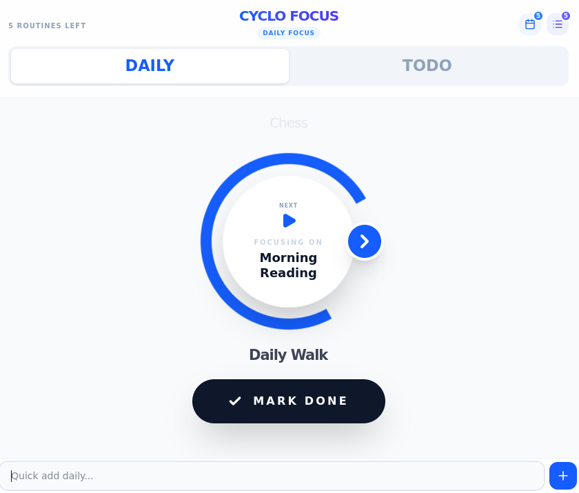

# Cyclo Focus

A self-hosted minimalist productivity focus app for sustainable work. CycloFocus helps you maintain focus on one task at a time while managing your daily routines and todo lists with a clean, distraction-free interface.

<div align="center">
  <p>
    
    
  </p>
</div>

---

## 🎯 Features

- **Dual Task Lists**: Separate daily routines and todo lists to organize your work
- **Focus Mode**: Highlights one current task to help you stay focused
- **Drag-and-Drop Sorting**: Reorder tasks by dragging them to customize your workflow
- **Persistent Storage**: Your tasks are automatically saved to Redis storage
- **Self-Hosted**: Full control over your data with Docker deployment
- **Minimalist Design**: Clean, modern UI built with React and Tailwind CSS

## 🛠️ Tech Stack

### Frontend
- **React 19** with TypeScript
- **Vite** for fast development and building
- **Tailwind CSS 4** for styling
- **Lucide React** for icons
- **@dnd-kit** for drag-and-drop sorting with keyboard accessibility

### Backend
- **Express.js** with TypeScript
- **Redis** for data persistence
- **Zod** for schema validation

### Infrastructure
- **Docker** & **Docker Compose** for containerization
- Multi-platform support (amd64/arm64)

## 🚀 Getting Started

### Prerequisites

- Docker and Docker Compose installed on your system
- (Optional) Node.js 18+ for local development

### Quick Start with Docker

1. Clone the repository:
```bash
git clone https://github.com/QuickOrBeDead/CycloFocus.git
cd CycloFocus
```

2. Start Redis for local development:
```bash
docker compose -f docker-compose.debug.yml up -d
```

3. Install dependencies and run locally:

**Backend:**
```bash
cd server
npm install
npm run dev
```

**Frontend (in another terminal):**
```bash
cd client
npm install
npm run dev
```

4. Access the application at [http://localhost:8080](http://localhost:8080)

## 🚀 Production Deployment

To deploy CycloFocus in production using Docker:

1. Copy the production Docker Compose file:
```bash
cp examples/docker-compose.yml .
```

> See the full [production Docker Compose configuration](examples/docker-compose.yml)

2. Start the application:
```bash
docker compose up -d
```

3. Access the application at [http://localhost:8900](http://localhost:8900)

The application will start two services:
- **App**: React + Express server on port 8900
- **Redis**: Data storage (internal)

### Production Docker Compose Configuration

The production setup uses a pre-built Docker image and includes both the application and Redis services:

```yaml
services:
  app:
    image: boraakgn/cyclofocus:alpha
    container_name: cyclo-focus-app
    restart: unless-stopped
    ports:
      - "8900:3000"
    environment:
      - REDIS_URL=redis://redis:6379
    depends_on:
      - redis
    healthcheck:
      test: ["CMD", "wget", "--quiet", "--tries=1", "--spider", "http://localhost:3000/health"]
      interval: 10s
      timeout: 5s
      retries: 5
      start_period: 10s

  redis:
    image: redis:8.4.0-alpine
    container_name: cyclo-focus-redis
    command: >
      redis-server
      --appendonly yes
      --save 60 1
      --dir /data
    volumes:
      - redis-data:/data
    restart: unless-stopped

volumes:
  redis-data:
```

**Service Details:**

- **app**: Pre-built application image running on port 8900 (mapped from 3000 inside container)
  - Automatically restarts on failure
  - Health checks ensure the service is responsive
  - Connects to Redis for data persistence
  
- **redis**: Alpine Linux-based Redis instance for data storage
  - Persistent storage with `--appendonly yes` (AOF persistence)
  - Saves database snapshots every 60 seconds if at least 1 key changed
  - Data stored in named volume `redis-data` to persist between container restarts

## 📋 Usage

1. **Switch Between Lists**: Use the "Daily" and "Todo" tabs to switch between your daily routines and general tasks
2. **Add Tasks**: Click the "+" button and enter your task
3. **Reorder Tasks**: 
   - **Mouse**: Drag tasks by the grip handle to arrange them in your preferred order
   - **Keyboard**: Tab to a task, press Space to grab it, use Arrow keys (↑↓) to move it, press Space again to drop it
4. **Focus on a Task**: Click the Play icon to set a task as your current focus
5. **Complete Tasks**: Check off completed tasks with the check icon
6. **Reset Daily Tasks**: Use the reset button to uncheck all daily tasks for a new day
7. **Manage Tasks**: Edit or delete tasks as needed

## 🏗️ Project Structure

```
CycloFocus/
├── client/                 # React frontend
│   ├── src/
│   │   ├── api/           # API client
│   │   ├── components/    # React components
│   │   ├── context/       # React context providers
│   │   └── types/         # TypeScript types
│   └── package.json
├── server/                # Express backend
│   ├── src/
│   │   ├── middleware/    # Express middleware
│   │   └── schemas/       # Zod validation schemas
│   └── package.json
├── examples/              # Docker Compose examples
│   └── docker-compose.yml # Production configuration
├── Dockerfile             # Multi-stage Docker build
└── docker-compose.debug.yml # Development Redis setup
```

## 🔧 Configuration

### Environment Variables

#### Server
- `REDIS_URL`: Redis connection URL (default: `redis://redis:6379`)

## 🐳 Building for Production

### Multi-platform Docker Images

Use the provided script to build images for multiple architectures:

```bash
./build-push-docker-images-multiplatform.sh
```

This builds images for both amd64 and arm64 platforms.

## 📊 API Endpoints

- `GET /health` - Health check endpoint
- `GET /api/list/:id` - Retrieve a task list (daily or todo)
- `POST /api/list/:id` - Save a task list

## 🤝 Contributing

Contributions are welcome! Please feel free to submit a Pull Request.

## 📄 License

This project is licensed under the MIT License - see the [LICENSE](LICENSE) file for details.

## 👤 Author

**Bora Akgün**

---

Built with focus and simplicity in mind. Stay productive! 🚀
